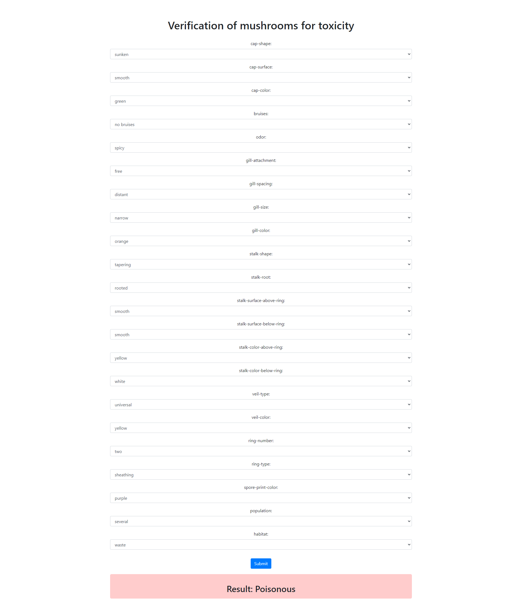

# MushroomClassificationAI
This project focuses on creating a web application for the classification of mushrooms as either edible or poisonous based on various attributes. The application utilizes a machine learning model trained on a dataset of mushroom attributes to make predictions.
### ***Created by Team23***

<br>

## Attribute information:

The following attributes are used for mushroom classification:

- **Cap Shape:** bell, conical, convex, flat, knobbed, sunken
- **Cap Surface:** fibrous, grooves, scaly, smooth
- **Cap Color:** brown, buff, cinnamon, gray, green, pink, purple, red, white, yellow
- **Bruises:** bruises, no bruises
- **Odor:** almond, anise, creosote, fishy, foul, musty, none, pungent, spicy
- **Gill Attachment:** attached, descending, free, notched
- **Gill Spacing:** close, crowded, distant
- **Gill Size:** wide, narrow
- **Gill Color:** black, brown, buff, chocolate, gray, green, orange, pink, purple, red, white, yellow
- **Stalk Shape:** enlarging, tapering
- **Stalk Root:** bulbous, club, cup, equal, rhizomorphs, rooted, missing
- **Stalk Surface Above Ring:** fibrous, scaly, silky, smooth
- **Stalk Surface Below Ring:** fibrous, scaly, silky, smooth
- **Stalk Color Above Ring:** brown, buff, cinnamon, gray, orange, pink, red, white, yellow
- **Stalk Color Below Ring:** brown, buff, cinnamon, gray, orange, pink, red, white, yellow
- **Veil Type:** partial, universal
- **Veil Color:** brown, orange, white, yellow
- **Ring Number:** none, one, two
- **Ring Type:** cobwebby, evanescent, flaring, large, none, pendant, sheathing, zone
- **Spore Print Color:** black, brown, buff, chocolate, green, orange, purple, white, yellow
- **Population:** abundant, clustered, numerous, scattered, several, solitary
- **Habitat:** grasses, leaves, meadows, paths, urban, waste, woods
### Kaggle: https://www.kaggle.com/datasets/uciml/mushroom-classification

<br>

## Getting Started

1. Clone the repository:

    ```bash
    git clone https://github.com/jabka1/MushroomClassificationAI
    cd mushroom-classification-web-app
    ```

<br>

## Usage

1. Select attributes for each feature from the dropdown menus.
2. Click the "Submit" button to classify the mushroom.
3. The result will be displayed with a corresponding background color:
   - Red background for poisonous mushrooms
   - Green background for edible mushrooms

## Demo


